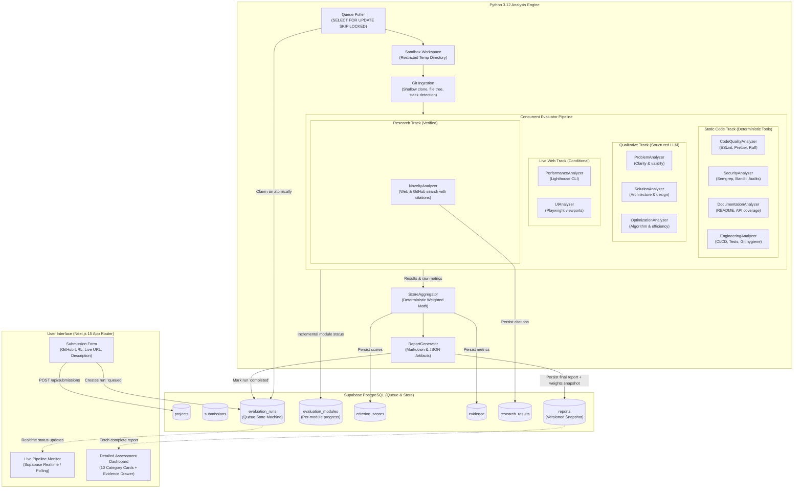
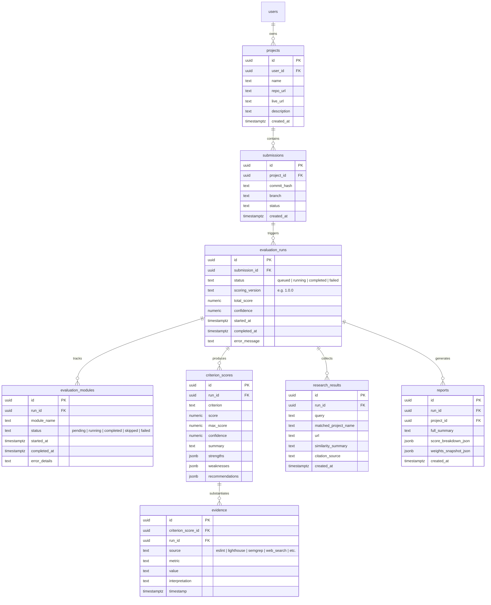
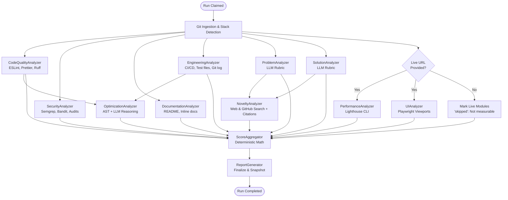
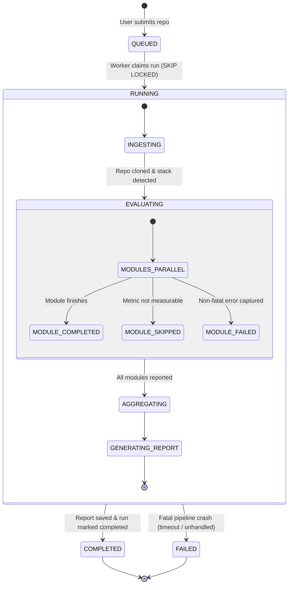

# Architecture Specification: EvalForge

**Version**: 1.0.0  
**Status**: APPROVED_PROPOSED  
**Author**: Lead Software Architect  
**Platform**: Project Analyzer AI (EvalForge)

---

## 1. Executive Summary & Core Principles

EvalForge is a production-oriented software project evaluation platform that accepts a GitHub repository URL, optional deployed URL, and optional project description to produce an evidence-backed score out of 100.

### Non-Negotiable Architectural Principles
1. **Deterministic First**: Measurements that can be obtained deterministically (code formatting, AST linting, test existence, security vulnerabilities, bundle size, Lighthouse metrics) are strictly executed via real tools—never guessed or simulated by an LLM.
2. **Qualitative Synthesis**: LLMs are restricted to structured reasoning: problem statement clarity, solution viability, architectural trade-offs, and contextual interpretation of deterministic evidence.
3. **Verified Novelty**: Web and GitHub research requires verifiable external URLs and citations. The system will never assert that a project is "common" or "derivative" without attached citation evidence.
4. **Untrusted Code Security**: Every submitted repository is treated as untrusted and potentially adversarial. No build scripts (`npm run build`, `make`, `setup.py`) or arbitrary commands are executed directly on the host application environment.
5. **Deterministic Scoring & Reproducibility**: Overall and category scores are calculated using a versioned, centralized weighting schema (`weights.v1.json`). Reports snapshot the exact rubric and weight configuration used during evaluation, guaranteeing that past reports remain reproducible over time.
6. **Explicit Absence of Evidence**: When a metric cannot be measured (e.g., no live URL provided), the platform outputs: `"Not measurable with the available submission"`. Missing evidence is never converted into positive scores.

---

## 2. Monorepo Folder Structure

```
EvalForge/
├── apps/
│   └── web/                               # Next.js 15 App Router (TypeScript + Tailwind CSS)
│       ├── app/
│       │   ├── layout.tsx                 # Technical dark mode root layout (OLED palette)
│       │   ├── page.tsx                   # Submission landing page
│       │   ├── dashboard/page.tsx         # User submissions & project history
│       │   ├── projects/[id]/page.tsx     # Live module progress & detailed report view
│       │   └── api/
│       │       ├── submissions/route.ts   # POST: Validate & enqueue submission
│       │       └── submissions/[id]/
│       │           └── status/route.ts    # GET: Real-time run & module progress
│       ├── components/                    # High-density UI/UX Pro Max components
│       │   ├── submission-form.tsx        # Validated input (Zod)
│       │   ├── evaluation-progress.tsx    # Live pipeline progress tracker
│       │   ├── score-overview.tsx         # 100-point gauge + category breakdown
│       │   ├── category-card.tsx          # Expandable score card with confidence
│       │   ├── evidence-drawer.tsx        # Raw evidence inspector (linters, logs, audits)
│       │   └── research-citations.tsx     # Web & GitHub citations list
│       ├── lib/
│       │   ├── supabase/                  # Server & Client Supabase handlers
│       │   ├── validators.ts              # Zod schemas for submission payloads
│       │   └── types.ts                   # Strongly-typed evaluation contracts
│       ├── tailwind.config.ts             # Tailwind CSS tokens (Dark Mode OLED)
│       ├── tsconfig.json
│       └── package.json
│
├── services/
│   └── worker/                            # Python 3.12 Evaluation Engine
│       ├── analyzer/
│       │   ├── __init__.py
│       │   ├── config.py                  # Env config, timeouts, pool sizes
│       │   ├── runner.py                  # Daemon polling Supabase queue (FOR UPDATE SKIP LOCKED)
│       │   ├── pipeline.py                # Asynchronous DAG orchestrator for evaluators
│       │   ├── sandbox.py                 # Isolated process execution & disposable workspaces
│       │   ├── ingestion/
│       │   │   ├── __init__.py
│       │   │   ├── git_client.py          # Shallow clone, branch inspection, size checks
│       │   │   ├── stack_detector.py      # Framework, package manager, and language discovery
│       │   │   └── file_tree.py           # AST file classification and hierarchy mapping
│       │   ├── evaluators/                # Modular, independently testable analyzers
│       │   │   ├── base.py                # Abstract BaseEvaluator & contract models
│       │   │   ├── problem_analyzer.py    # Problem statement clarity & relevance (LLM rubric)
│       │   │   ├── solution_analyzer.py   # Solution design & system architecture (LLM rubric)
│       │   │   ├── code_quality.py        # ESLint, Prettier, Ruff, AST complexity (Tool)
│       │   │   ├── optimization.py        # Performance & resource reasoning (LLM + AST)
│       │   │   ├── ui_analyzer.py         # Playwright headless viewports & DOM audits (Tool)
│       │   │   ├── performance.py         # Lighthouse CLI metrics & Core Web Vitals (Tool)
│       │   │   ├── security.py            # Semgrep, Bandit, pip/npm audit, secrets scan (Tool)
│       │   │   ├── novelty.py             # Web & GitHub search with citations (Research)
│       │   │   ├── documentation.py       # README, inline docstrings, API coverage (Hybrid)
│       │   │   └── engineering.py         # CI/CD, unit test presence, commit hygiene (Tool)
│       │   ├── scoring/
│       │   │   ├── __init__.py
│       │   │   ├── aggregator.py          # Deterministic weighted math & confidence aggregation
│       │   │   └── rubrics.py             # Rubric loader and version validator
│       │   ├── reporting/
│       │   │   ├── __init__.py
│       │   │   └── report_generator.py    # Generates final structured report JSON
│       │   └── db.py                      # Supabase PostgreSQL client & atomic transactions
│       ├── tests/                         # Unit tests with mock tools and mock LLM
│       │   ├── test_aggregator.py         # Deterministic score aggregation tests
│       │   ├── test_evaluator_contracts.py# Schema validation on evaluator outputs
│       │   ├── test_sandbox.py            # Security & isolation tests
│       │   └── test_pipeline_dag.py       # Concurrency and DAG execution tests
│       ├── pyproject.toml
│       └── requirements.txt
│
├── packages/
│   └── shared/                            # Centralized contracts & configurations
│       ├── weights.v1.json                # Category weights strictly summing to 100
│       ├── rubrics.v1.json                # Qualitative LLM evaluation rubrics
│       └── schemas/
│           ├── evaluation_result.json     # Standardized JSON schema for evaluator results
│           └── report_schema.json         # Full report output schema
│
└── supabase/
    └── migrations/
        └── 20260906000001_initial_schema.sql # Core tables, indexes, RLS, queue procedures
```

---

## 3. System Architecture Diagram



---

## 4. Database Entity Overview

All database tables are defined with strict foreign keys, timestamps, indexes, and row-level security:



### Atomic Claim Function (PostgreSQL Queue Worker)
```sql
CREATE OR REPLACE FUNCTION claim_next_evaluation_run(worker_id TEXT)
RETURNS SETOF evaluation_runs AS $$
BEGIN
    RETURN QUERY
    UPDATE evaluation_runs
    SET status = 'running',
        started_at = NOW()
    WHERE id = (
        SELECT id
        FROM evaluation_runs
        WHERE status = 'queued'
        ORDER BY created_at ASC
        FOR UPDATE SKIP LOCKED
        LIMIT 1
    )
    RETURNING *;
END;
$$ LANGUAGE plpgsql;
```

---

## 5. Evaluator Dependency Graph (DAG)

Evaluators execute concurrently based on dependencies to minimize overall latency:



---

## 6. Evaluation Lifecycle & State Machine



---

## 7. Security Boundaries & Untrusted Code Isolation

```
+-------------------------------------------------------------------------------+
| HOST APPLICATION SERVER (Next.js & Worker Main Process)                       |
|  - Manages API, Supabase connection, LLM requests, and job orchestration      |
+---------------------------------------+---------------------------------------+
                                        | (Fork / Subprocess with strict sandbox)
                                        v
+-------------------------------------------------------------------------------+
| ISOLATED EVALUATION WORKSPACE (Disposable /tmp directory)                     |
|                                                                               |
|  1. Filesystem:                                                               |
|     - Repository cloned into disposable temporary dir: /tmp/evalforge_<run_id> |
|     - Directory mounted with restricted permissions (0700)                    |
|     - Purged completely upon evaluation completion (finally block)            |
|                                                                               |
|  2. Network Restrictions:                                                     |
|     - Outbound internet DISABLED during static analysis execution             |
|     - Only git clone and specific research endpoints have internet access    |
|                                                                               |
|  3. Process Throttling & Limits:                                              |
|     - Max memory limit: 1.5GB per analyzer subprocess                         |
|     - CPU quota: restricted per process                                      |
|     - Hard execution timeout: 60s per tool command                            |
|     - Non-root user execution                                                 |
|                                                                               |
|  4. Strict Tool Execution (No Arbitrary Code Execution):                       |
|     - Tools invoked directly by executable binary path (e.g. `npx eslint`)    |
|     - Zero execution of user-supplied package install scripts (`npm install`)  |
|     - Zero invocation of user Makefile, build scripts, or Dockerfiles         |
+-------------------------------------------------------------------------------+
```

---

## 8. Scoring Architecture & Versioned Rubrics

### Category Weights (Total: 100)
Stored centrally in `packages/shared/weights.v1.json`:
```json
{
  "version": "1.0.0",
  "categories": {
    "problem_statement": { "weight": 10, "evaluator": "ProblemAnalyzer" },
    "solution_quality": { "weight": 15, "evaluator": "SolutionAnalyzer" },
    "code_quality": { "weight": 15, "evaluator": "CodeQualityAnalyzer" },
    "optimization": { "weight": 10, "evaluator": "OptimizationAnalyzer" },
    "ui_ux": { "weight": 15, "evaluator": "UIAnalyzer" },
    "performance": { "weight": 15, "evaluator": "PerformanceAnalyzer" },
    "security": { "weight": 10, "evaluator": "SecurityAnalyzer" },
    "novelty": { "weight": 5, "evaluator": "NoveltyAnalyzer" },
    "documentation": { "weight": 5, "evaluator": "DocumentationAnalyzer" },
    "engineering_practices": { "weight": 10, "evaluator": "EngineeringAnalyzer" }
  }
}
```

### Standard Evaluator Contract
Every evaluator implements `BaseEvaluator` and returns a validated Pydantic model:
```python
class EvidenceItem(BaseModel):
    source: str           # e.g., "eslint", "lighthouse", "semgrep", "web_search"
    metric: str           # e.g., "error_count", "first_contentful_paint", "cve_count"
    value: Any            # e.g., 0, "1.2s", "CVE-2023-xxxx"
    interpretation: str   # e.g., "No critical lint errors detected in source AST"
    timestamp: datetime

class EvaluationResult(BaseModel):
    criterion: str        # e.g., "code_quality"
    score: float          # Actual calculated score
    max_score: float      # Maximum score for this criterion
    confidence: float     # 0.0 to 1.0 confidence based on metric coverage
    summary: str          # Concise findings summary
    strengths: list[str]  # Key identified strengths
    weaknesses: list[str] # Identified deficiencies
    recommendations: list[str] # Actionable fixes
    evidence: list[EvidenceItem]
```

### Missing Evidence Policy
If a metric cannot be collected (e.g. no live URL for Lighthouse/Playwright), the result explicitly records:
- `summary`: `"Not measurable with the available submission."`
- `evidence`: Metric marked as `unmeasurable` with reason.
- Score is kept at 0 or scaled strictly according to rubric policy—never inflated.

### Reproducibility Guarantee
When a report is generated, `reports.weights_snapshot_json` records the exact JSON schema and weights used. If weights change in `weights.v2.json`, historic reports retain their original calculations.

---

## 9. API Boundaries & Contracts

### 1. `POST /api/submissions`
- **Request**:
  ```json
  {
    "repoUrl": "https://github.com/owner/repo",
    "liveUrl": "https://deployed-app.com", // Optional
    "description": "Short project summary" // Optional
  }
  ```
- **Validation**: Zod schema checks valid GitHub repository URL format and URL protocols.
- **Response**: `201 Created` with `{ "projectId": "uuid", "submissionId": "uuid", "runId": "uuid", "status": "queued" }`.

### 2. `GET /api/submissions/[id]/status`
- **Response**: `200 OK`
  ```json
  {
    "runId": "uuid",
    "status": "running", // queued | running | completed | failed
    "startedAt": "2026-09-06T06:00:00Z",
    "completedAt": null,
    "modules": [
      { "name": "CodeQualityAnalyzer", "status": "completed" },
      { "name": "SecurityAnalyzer", "status": "running" },
      { "name": "PerformanceAnalyzer", "status": "pending" }
    ]
  }
  ```

### 3. `GET /api/projects/[id]/report`
- **Response**: `200 OK` returning total score out of 100, confidence score, 10 categorized criteria breakdown, strengths, weaknesses, recommendations, research citations, and raw evidence lists.

---

## 10. Local Development & Testing Strategy

1. **Database**: Supabase local CLI (`npx supabase start`) or cloud project connection via standard `.env` variables (`NEXT_PUBLIC_SUPABASE_URL`, `SUPABASE_SERVICE_ROLE_KEY`).
2. **Worker Execution**:
   - `python -m analyzer.runner --poll-interval 2`
   - Configurable `--mock-tools` flag to run unit & integration tests without needing native tool installations or network access.
   - Configurable `--mock-llm` flag returning deterministic mock JSON for cost-free CI runs.
3. **Frontend**: Next.js 15 local dev server (`pnpm dev` or `npm run dev`) at `http://localhost:3000`.
4. **Automated Verification**:
   - Python: `pytest services/worker/tests/`
   - Frontend: `npm run lint` & `npm run build`
   - End-to-end flow test: A single CLI smoke test submitting a fixture repo and verifying end-to-end report generation in Supabase.
